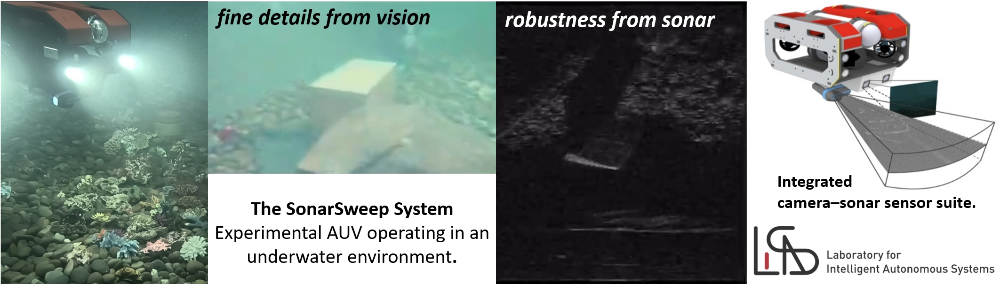
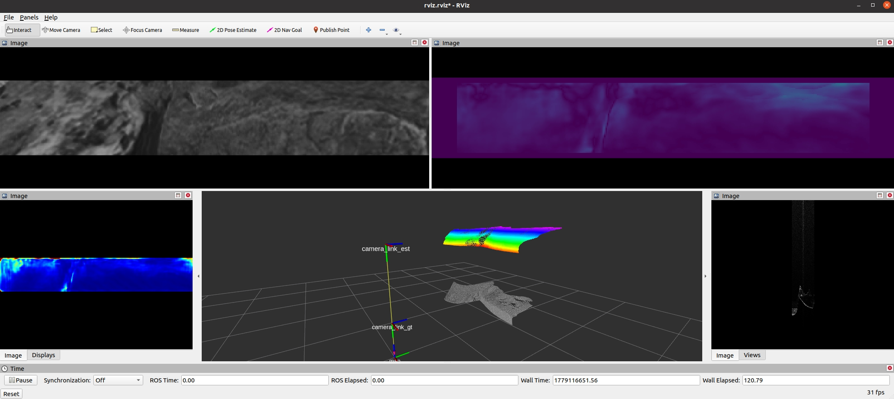

# SonarSweep

**SonarSweep: Fusing Sonar and Vision for Robust 3D Reconstruction via Plane Sweeping**

SonarSweep is an end-to-end learning framework for dense underwater 3D reconstruction from synchronized camera and forward-looking sonar data. The method adapts deep plane sweeping to cross-modal sonar-vision fusion: sonar features are back-projected onto candidate planes, differentiably warped into the camera view, and matched with camera features through a learned cost volume to regress dense metric depth.



The project targets robust reconstruction in visually degraded underwater environments, where camera-only methods suffer from turbidity and short stereo baselines, while sonar-only methods are limited by elevation ambiguity and low spatial resolution.


## Installation

Please install PyTorch according to your GPU driver and CUDA version from the official PyTorch website:

https://pytorch.org/get-started/locally/

Then install the remaining dependencies:

```bash
pip install -r requirements.txt
```

## Testing

We have uploaded the data used in this project to Hugging Face:

https://huggingface.co/datasets/Lingpenghaha/Sonarsweep_dataset/tree/main

If you are interested in recording and building your own dataset, we also provide the full dataset construction pipeline:

1. Build an OceanSim-based simulator and record rosbag files. Please refer to https://github.com/LingpengChen/LIAS_oceansim
2. Process the recorded rosbag files into a usable SonarSweep dataset. Please refer to https://github.com/LingpengChen/SonarSweep_dataset

If you want to directly use our dataset, we provide a simulated dataset with more than 7,000 data points.

For a quick test, download the test split:

```bash
python3 utils/download_test_dataset.py
```

`download_test_dataset.py` downloads both `vfov12hfov60_test/` and `test.txt` into the `data/` folder.

For the full simulated dataset, run:

```bash
python3 utils/download_full_dataset.py
```

The full dataset contains dozens of trajectories with different data sizes. In our training setup, 60% of the trajectories are used for training, 20% for validation, and 20% for testing.

We recommend downloading the test data first with `utils/download_test_dataset.py`. After the download is complete, you can directly run:

```bash
python test.py

# Common options include:
python test.py --data <dataset_path> --pretrained-dps <checkpoint_path> --output-dir <output_dir>
```

By default, the testing results are saved under `result/vfov12hfov60_test/test`.

You can visualize the output results with RViz and `rviz_depth.py`:

```bash
rviz -d config/rviz.rviz
python3 rviz_depth.py
```




## Performance

<table>
  <tr>
    <td align="center"><strong>Simulation performance</strong></td>
    <td align="center"><strong>Real-world performance</strong></td>
  </tr>
  <tr>
    <td></td>
    <td></td>
  </tr>
</table>


## Undergoing Improvement

The core idea of SonarSweep is **cross-modal geometric matching**. Sonar does not capture appearance or texture; it observes occupancy-like acoustic responses and the geometric structure illuminated by sound waves. Therefore, the camera branch should not rely heavily on RGB texture or color cues, which may introduce modality-specific bias and hurt sonar-vision correspondence.

In the current pipeline, the image is converted to grayscale to actively suppress RGB appearance information and push the visual representation toward a more **geometry-matchable feature space**. We are now implementing an improved camera-side representation by adding a monocular depth prior, such as a scale-ambiguous depth map predicted by Depth Anything V2, as an additional input channel. Early experiments show that this direction brings measurable performance improvements.

The proposed input becomes:

```text
Camera input = grayscale image + relative depth map
```

Although the predicted depth is not metrically scaled, it provides useful structural cues such as object boundaries, surface layout, and relative depth ordering. These cues are more consistent with the geometric nature of sonar observations and may improve feature matching within the plane-sweep cost volume, leading to more robust and accurate depth estimation.

## Practical Notes

Through extensive experiments, we also acknowledge that robust underwater depth estimation requires a large amount of diverse data. The generalization ability of our current method is still limited, especially because sonar data usually has a larger domain gap than visual data. Different sonar devices, mounting configurations, water conditions, acoustic noise patterns, and scene geometries can all introduce significant **distribution shifts**, making cross-modal learning even more challenging.

**We are currently working on collecting and releasing more real-world cross-modal sonar-vision datasets.** In parallel, we are also exploring self-supervised depth estimation methods beyond fully supervised training, with the goal of reducing the dependence on dense ground-truth depth and improving real-world generalization.

## Citation

We would appreciate citation of:

```bibtex
@article{chen2025sonarsweep,
  title={SonarSweep: Fusing Sonar and Vision for Robust 3D Reconstruction via Plane Sweeping},
  author={Chen, Lingpeng and Tang, Jiakun and Chui, Apple Pui-Yi and Hong, Ziyang and Wu, Junfeng},
  journal={arXiv preprint arXiv:2511.00392},
  year={2025}
}
```
